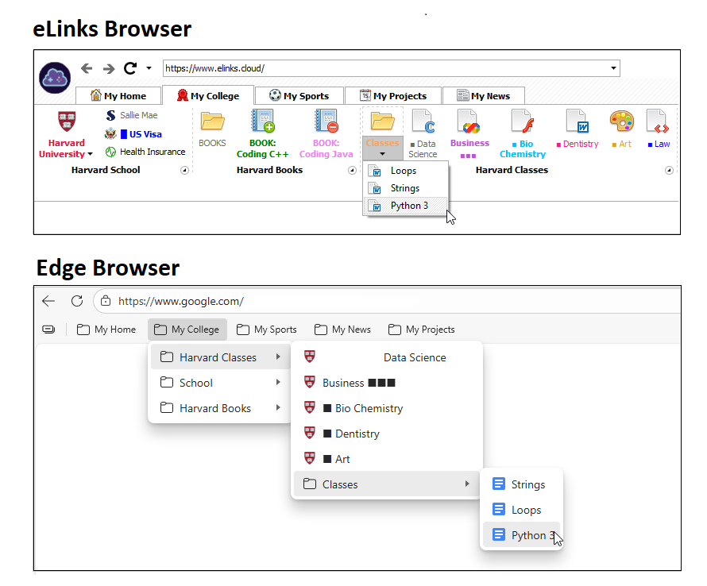
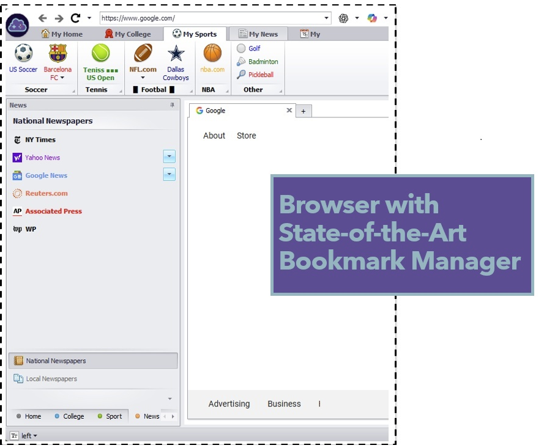
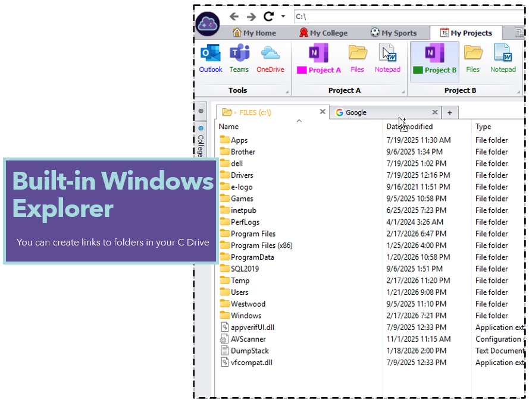

# eLinks.cloud 

A minimalistic browser with a state-of-the-art bookmark manager
try it:   http://www.elinks.cloud

See comparisons between Microsoft Edge vs eLinks using the same bookmarks so they can be compared side by side

More screenshot of elinks Browser

